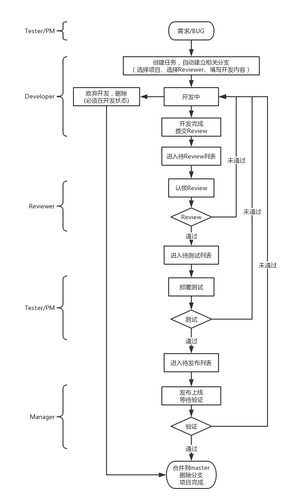

# redmaple
golang语言写的git开发测试上线流程管理系统

## 特性
* 完善的git工作流[查看](#git工作流)，支持多个任务同时进行
* 分支上多个commit自动合并为一个，并填充开发内容作为commit信息
* 各个环境通过ssh操作，支持密码、密钥文件、密钥文本认证，但不需要安装ssh软件
* 同环境多机器并行部署，不会影响项目运行，支持服务器是跳板机（未来可以支持多重跳板）
* go语言编写，本地只需安装git并加入到PATH，无需安装ssh，除非git是ssh认证
* 因为用到sh命令，暂不支持win
* 只需要本机可以访问git，其他机器都不需要
* 邮件通知

## 要求
* 目前只支持git和php，需要本地安装git命令，默认路径是/usr/bin/git
* 每个环境的配置要一样，包括wwwroot、user等,项目不能为空，必须要有提交记录
* 部署后的代码默认目录权限是755，文件权限是644，所以项目发布后运行过程中不能创建目录和写入文件
* 每个开发任务，功能上最好不要重叠，以免合并的时候发生冲突
* 提测后，不要在分支上继续开发，除非流程上先回到开发，这样可以保证所有代码经过review和测试

## 待改进
* 并发控制粒度比较大
* 权限控制粒度比较大

## 未来特性
* 在线Review
* 接入phpunit，可以查看report
* 新机器上线，项目列表加上：三大环境重新部署（dev:master test:test prod:master）
* 引入go的git软件包，不用装git工具
* 定时自动发布 （发布前X时间内，不允许操作测试通过）
* 支持websocket来推送新消息
* 支持设置每个操作的邮件通知对象

## Git工作流

